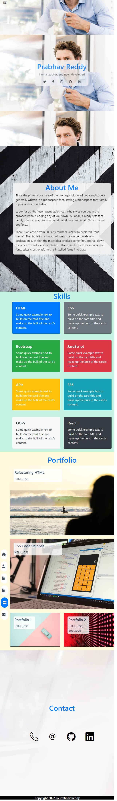
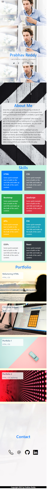

# Bootstrap Portfolio

## Project Links
Deployed Link: https://nrprabhav.github.io/Bootstrap-Portfolio/

Repository Link: https://github.com/nrprabhav/Bootstrap-Portfolio

## Description
A portfolio page that showcases the software projects that I have built. The project uses Bootstap, HTML and CSS.

## Features of the Page
* Sections on the page about me, my work, and how to contact me
* Links to the sections on the navigation bar on left-hand side of the page
* All links highlight when you hover on it

### Navigation bar
* Navigation bar stays on a fixed location on the window all the time
* The navigation bar on the left of the page can be toggled by clicking the button on the top-left corner
* Different links in the navigation bar are highlighted depending on which section you are in
* Navigation bar is responsive to screen size

### About Me
* The text box changes size depending on screen size

### Skills
* CSS grids are used for arranging Bootstrap cards in the skills section - each card contains details of a project and links to it
* The arrangement of the cards is responsive to screen size

### Portfolio
* CSS grids are used for arranging Bootstrap cards in the portfolio section - each card contains details of a project and links to it
* The arrangement of the cards is responsive to screen size

### Contact
* The icons can be clicked to directly go to the specific mode of contact
* The icons change size to respond to the screen size

## Screenshots
Screenshot for a wide screen:
* Note that the navigation bar is fixed at one position on the screen - this is misleading in the screen shot

Screenshot for a medium screen:
* Notice that the navigation bar has changed. Only the icons appear - the text has disappeared in the narrower screen

Screenshot for small screen:
* Notice that though the navigation bar is visible by default, it can be made invisible by clicking on the Navbar icon at the top-left corner (this is shown in the figure)
* Notice also the change in the arrangment of the page especially in the portfolio section

